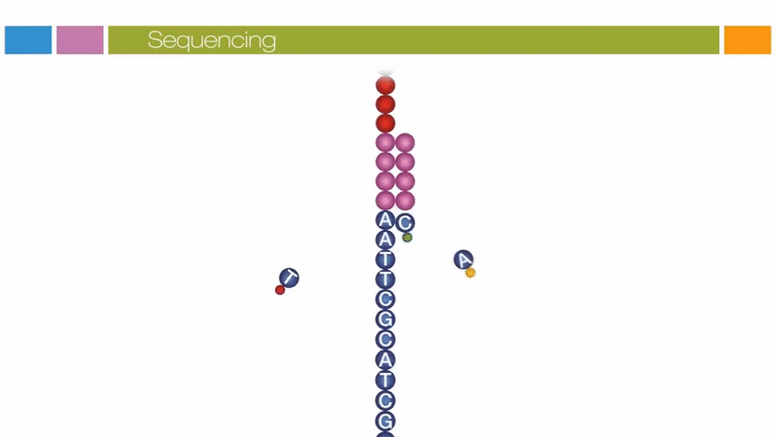

<!-- _class: lead -->

# Amplicon Sequencing using MinION vs Illumina - A Personal Experience
### Xiaoping Li
#### June 10, 2022

---

<!-- _class: rest -->

# Background

---
<!-- _class: rest -->
# Platform Comparisons (# of publications)

  

---
<!-- _class: rest -->
# Platform Comparisons (specificationsa)
  

|Platform | Multiplexing (samples) | yield | read length | raw read accurarcy | No. of reads |
|:---:    | :---:     | :---: |:---: | :---: | :---: |
|MinION| 96 | 25 Gb | up to 4Mbp | 98.3%> | 25M
|Miseqb| 96 | 13.2-15Gb | 300 bp | >99.999% | 25M |

a: Offical data
bPaired ends, v3 kit, 600-cycle

---
<!-- _class: rest -->
# Platform Comparisons (pricing)
  

|Platform | lib prep | Sequencing |
|:---     | :---     | :---       |
|MinION|||
|Miseqa|$23|$1910b|

a: Virginia Tech sequencing facility 
b: Pair-end, V3 kit, 300bp

---

<!-- _class: rest -->
# Study example
